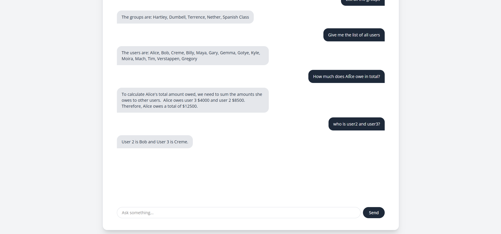

# Shared Expense Manager

<sub>NeurixAI Assignment</sub>

A full-stack web application to manage and split group expenses among users. Built with a React (Vite) frontend, FastAPI backend, PostgreSQL database, and Docker for containerization. The backend leverages LlamaIndex and the Gemini API to create an intelligent agent with tools that connect to the PostgreSQL database, utilizing Chain-of-Thought (CoT) prompting for enhanced reasoning and query processing.

---
## How does it look?




---
## Tech Stack

| Layer     | Technology                               |
|-----------|------------------------------------------|
| Frontend  | ReactJS,TailWindCss                      |
| Backend   | FastAPI (Python), LlamaIndex, Gemini API |
| Database  | PostgreSQL (ORM : sqlalchemy)            |
| DevOps    | Docker Compose                           |

---

## Features

- User and group management
- Add and track shared expenses
- View group-wise and individual balances
- RESTful API with auto-generated Swagger docs
- Intelligent agent powered by LlamaIndex and Gemini API, with tools for querying PostgreSQL
- Chain-of-Thought (CoT) prompting for enhanced backend reasoning
- Docker-based setup for easy development and deployment

---

## Prerequisites

- Git
- Docker
- Docker Compose
- PostgreSQL


---

## Getting Started

### 1. Clone the repository

```bash
git clone https://github.com/all-coder/shared-expense-manager.git
cd shared-expense-manager
```

---
### 2. pgAdmin (PostgreSQL)

- Open **pgAdmin**, the graphical interface for managing PostgreSQL databases.
- Connect to your local PostgreSQL server (default username is usually `postgres`).
- In the Object Browser:
  - Right-click on **Databases** → **Create** → **Database**.
  - Enter a name for your database (e.g., `shared_expense_db`) and click **Save**.

### 3. Configure Environment Variables

Create the following `.env` files:

**backend/.env**
```
DATABASE_URL=postgresql://postgres:postgres@db:5432/expenses
GOOGLE_GENAI_USE_VERTEXAI=FALSE
GOOGLE_API_KEY=your_gemini_api_key
```

**frontend/.env**
```
VITE_BACKEND_URL=http://localhost:5000
```

Important: Do not commit real `.env` files. Commit `.env.example` files instead with placeholder values.

## Docker Setup

### Build and run all services

To build and start all services defined in the `docker-compose.yml` file:

```bash
docker compose up --build
```

To run services in detached mode (in the background):

```bash
docker compose up --build -d
```

### Access the services

- Frontend: http://localhost:3001
- Backend (FastAPI Swagger UI): http://localhost:5000/docs

### Stop the services

To stop and remove the containers, networks, and volumes:

```bash
docker compose down
```

To stop services without removing resources:

```bash
docker compose stop
```

To remove containers, networks, and volumes, including persistent data:

```bash
docker compose down -v
```

---

## Agent Implementation

The backend uses LlamaIndex integrated with the Gemini API to create an intelligent agent capable of processing complex queries. The agent employs tools to connect directly to the PostgreSQL database for data retrieval and manipulation. Chain-of-Thought (CoT) prompting is utilized to improve the agent's reasoning process, enabling more accurate and context-aware responses.

---

## License

This project is licensed under the MIT License.